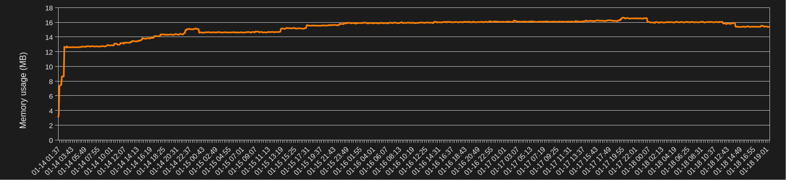

## TinyAP
micro-blogging software built on ActivityPub, part of the Fediverse.

NoJS, Fast, Lightweight.

Demo: [@alice@tinyap.izkluxcvy.foo](https://tinyap.izkluxcvy.foo/@alice)

## Features

- Federate with remote users
- Create text note
- Follow, Reply, Like, Boost, Undo them
- Block domain
- Tiny memory usage
- Tiny web UI
- Mastodon-compatible API

### Memory usage

Real memory usage of `tinyap.izkluxcvy.foo`

```sh
$ watch -n 360 'echo $(date "+%F %T"),$(cat /sys/fs/cgroup/system.slice/tinyap.service/memory.current) >> memory.csv'
```



### Tested clients

- [Phanpy](https://phanpy.social/) for Web
- [Pinafore](https://pinafore.social/) for Web
- [Tokodon](https://apps.kde.org/tokodon/) for Linux, Windows
- [Tuba](https://tuba.geopjr.dev/) for Linux, Windows
- [Ice Cubes](https://apps.apple.com/us/app/ice-cubes-for-mastodon/id6444915884) for iOS, Mac
- [Tusky](https://tusky.app/) for Android
- [Toot](https://github.com/ihabunek/toot) for CLI, TUI

## Requirements

- Rust (for building from source)
- SQLite or PostgreSQL
- Http**S**

## Installation

### Debian package

Download .deb package from [Releases](https://github.com/izkluxcvy/tinyap/releases/)

Install TinyAP

```sh
$ sudo apt install ./tinyap_amd64.deb
$ tinyap --version
```

Configure and run

```sh
$ sudo vi /etc/tinyap/config.yaml
$ sudo systemctl enable --now tinyap.service
```

### Build from source

Clone git repo.

```sh
$ git clone --depth 1 https://github.com/izkluxcvy/tinyap.git
$ cd tinyap
```

Create database.

```sh
$ # for SQLite
$ sqlite3 tinyap.db < schema.sql

$ # for PostgreSQL
$ psql -U postgres -c "CREATE DATABASE tinyap"
$ sed -e "s/INTEGER PRIMARY KEY AUTOINCREMENT/BIGSERIAL PRIMARY KEY/g" schema.sql | psql -U postgres -d tinyap
```

Configure your config.yaml.

```sh
$ vi config.yaml
```

Build and run

```sh
$ cargo build --release --features=sqlite,web,api

$ mv target/release/tinyap ./
$ cargo clean

$ ./tinyap --help
$ ./tinyap serve
```

### Build feature flags:

- `sqlite`: use SQLite for DB (must be exclusive with postgres)
- `postgres`: use PostgreSQL for DB
- `web`: text-based tiny Web UI
- `api`: mastodon-compatible API
- `tls`: tinyap as a TLS termination

### Config file path

You can place in `./config.yaml` or `/etc/tinyap/config.yaml` or `$TINYAP_CONFIG`

```sh
$ TINYAP_CONFIG=/path/to/config.yaml ./tinyap serve
```

## Customizing Web UI

### templates/

HTML with [Jinja](https://en.wikipedia.org/wiki/Jinja_(template_engine)) template format.

Loaded once when server starts.

### static/

Static files like style.css.

Loaded on each access to /static/xxx.xx.